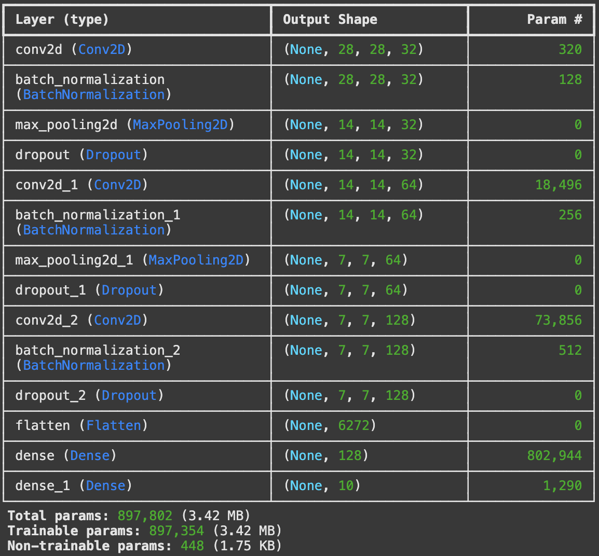
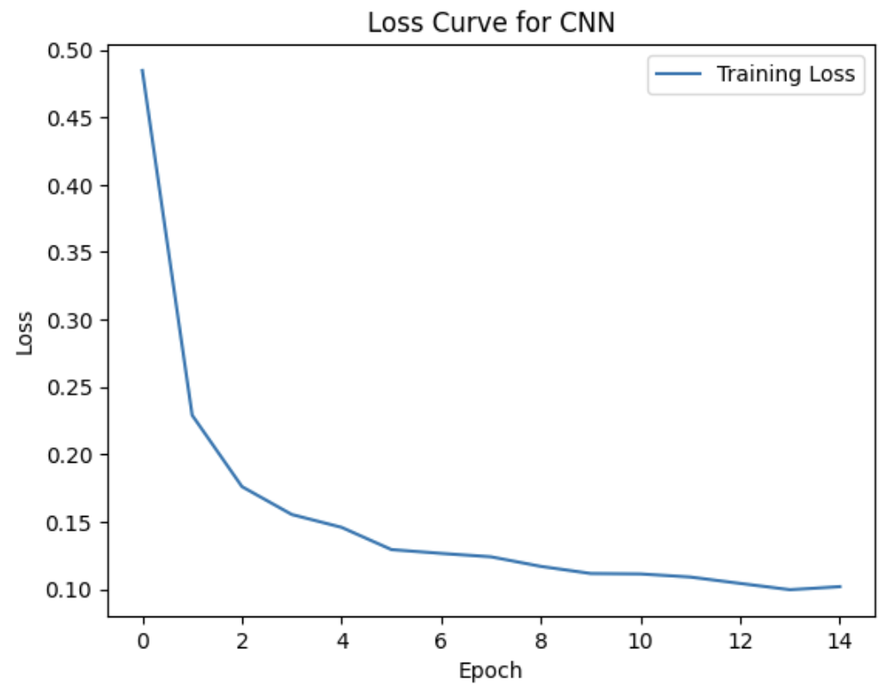

# Live Digit Recognition Using CNN 

This project is an interactive digit classifier that uses a Convolutional Neural Network (CNN) trained on the MNIST dataset. It features a sketchpad interface built with [Gradio](https://www.gradio.app/) and is deployed live on Hugging Face Spaces.

---
## Features: 
- **Deep CNN Architecture** with BatchNormalization and Dropout for robust performance.
- **Real-Time Inference** using a Gradio sketchpad for interactive predictions.
- **Data Augmentation** during training to improve generalization on messy, unseen input.
- **Deployed on Hugging Face Spaces** for live demonstration and ease of access.
--- 
## Live Demo: 
[Try it out on Hugging Face Spaces](https://huggingface.co/spaces/rezaenayati/Live_Digit_Recognition_Using_CNN)

Just draw a digit and hit Submit.  
The model will return the top 3 guesses along with their confidence scores.

---
## How it works: 
1. The model was trained on the MNIST dataset, a collection of 28×28 grayscale images of handwritten digits. Each pixel value represents the intensity of the digit stroke, with darker pixels indicating higher stroke intensity. The dataset includes 60k training examples and 10k test examples. 

2. After loading the data, the values in the dataset were normalized simply by dividing each digit in the dataset by 255.0 to get the values in a range of [0, 1]. This makes gradient descent more stable and helps the network converge faster by keeping input values in a small, consistent range. I also reshaped the matrices in the training and test examples to turn them into 4D arrays, which makes them compatible with the Conv2D layers in Keras.

3. **Model Setup:**
* For the model architecture, I first used two **convolutional layers** with **32** and **64** units respectively, using the **ReLU** activation with a window size of **(3,3)**. After each of the convolutional layers, I did **MaxPooling** with a pool size of **(2,2)**.
After the convolutional layers, I had to flatten the data using the **`Flatten()`** method in the model to be able to feed the training examples into the single **Dense** hidden layer that I had, with **128** activation units, still using **ReLU**.
* The output layer was a **Dense** layer with **10** units corresponding to digits **0–9**, with a **linear** activation and **L2 regularization**. I didn't use a traditional **Softmax** to get rid of intermediate values and instead ran a **softmax function after the model had made a prediction**.
* Although this model had a high accuracy rate on the MNIST dataset, it performed extremely poorly on real human-drawn digits using the Gradio Sketchpad. To improve the model, I decided to add an extra **convolutional layer** with **128** units and **ReLU** activation, add **BatchNormalization** to make the gradients more stable and speed up convergence, along with **Dropout** (set to **0.25**) to make sure the model doesn't overfit by randomly dropping a fraction of neurons during training.
* I’ve attached a picture of the final model summary and the final loss curve below to show the convergence. The loss curve is actually quite amazing, it drops rapidly and steadily gets lower.

| Layer | Units | Activation | Notes |
|-------|-------|------------|-------|
| Conv2D | 32 → 64 → 128 | ReLU | (3×3) kernels, max pooling after each |
| Dense | 128 | ReLU | |
| Output | 10 | Linear | Softmax applied post-inference |

  
  

4. Even though this model was performing slightly better than the first version, it still wasn't up to standard for detecting unseen digits. To make the model more general, I decided to use **Data Augmentation** via **`ImageDataGenerator`**, more specifically **stochastic augmentation with Keras**.
This creates a data generator that applies **random transformations** to the training images every time they're fed to the model. These transformations simulate messy, real-world drawings by **rotating** the images, **shifting** them, and **zooming in or out** by about 10%. This ensures the model sees a slightly different version of the data in every epoch.
This method led to **substantial improvements** in predicting real-life handwritten digits and is the final model used in the live demo.

5. To fit the model to my data, after some trial and error with the new architecture, I used **15 epochs** with a **batch size of 128**. This allowed the model to reach convergence steadily, achieving a final accuracy of 99.37% on the training data. The training time was relatively fast thanks to [Google Colab's](https://colab.google/) T4 GPUs. 
---
##  Technologies Used
- Python 3.9
- TensorFlow 2.15
- Keras
- Gradio
- Hugging Face Spaces
- Google Colab (T4 GPU)
---

## Code
-  The training code is available in `CNN_Model_Training.ipynb`.
-  The live app logic (Gradio + preprocessing) is in `app.py`, used for deployment on Hugging Face Spaces.
-  The trained model is included as `cnn_model_v2.h5`.

## Final Thoughts
Thank you for reading through this project, I had a lot of fun building it. I hope you enjoy exploring it as much as I did!
